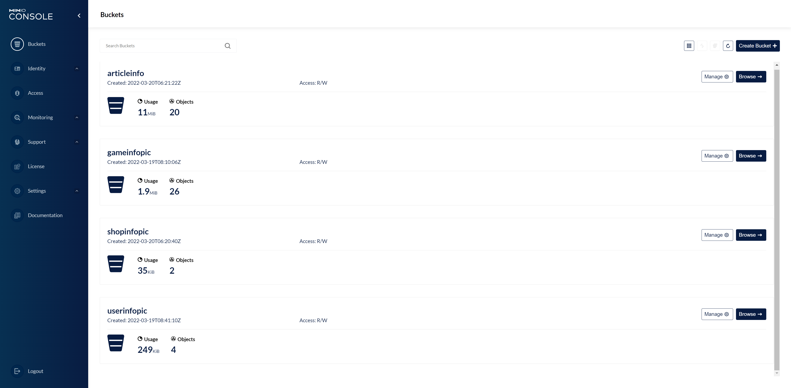
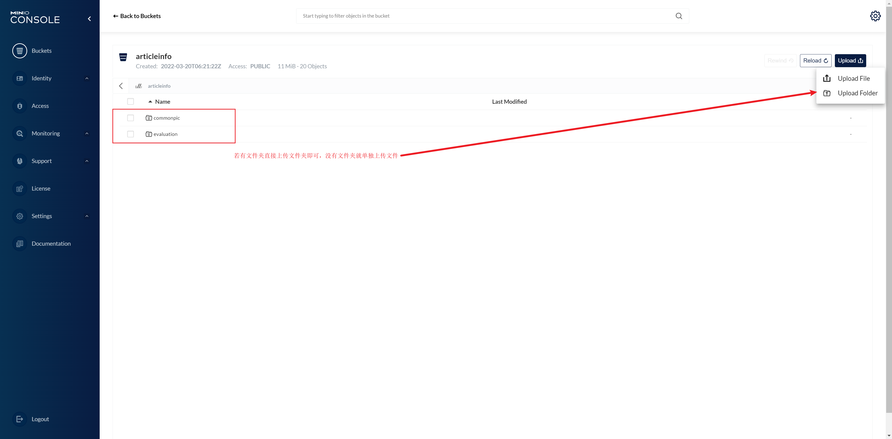

# evaluationSite Vue
基于微服务游戏测评网的前端项目，使用Vue建设。

### 项目依赖安装

```bash
npm install
```

### 编译运行

```bash
npm run dev
```

### 打包

```bash
npm run build
```

# MinIO OSS 配置
该前端项目使用的图片资源都存储在 Minio oss 上，在项目中使用http://localhost:9000/访问文件资源。

## MinIO 初始化
1. 进入 http://localhost:9001 登录进入系统(确保后台系统的容器启动)：Username:zhousl, Password:zhou11..
2. 在 Buckets 中创建以下四个桶: articleinfo，gameinfopic，shopinfopic，userinfopic 如下图所示：



3. 保证每一个桶的Access属性为Public，不然跨域的资源访问会被禁止：


4. 进入本项目的 /public/setup 将压缩包解压后，将对应的文件夹或文件上传到对应的桶中：



# 运行
进入 http://localhost:3000/

### 测试账号预设：
#### 管理员角色用户：userName： admin PassWord: zhou11..
#### 测评人员角色用户：userName： liukc PassWord: zhou11..
#### 普通角色用户：userName： zhousl PassWord: zhou11..
